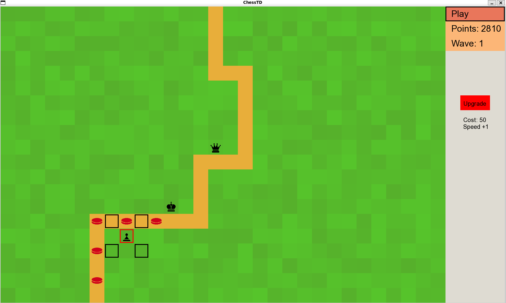

# Chess TD

A chess themed tower defence game that was created as a group project in fall 2022 in Aalto University course ELEC-A7151.

# Group
- Joel Toppinen
- Miikka Åsnabrygg
- Petrus Nikoskinen
- Petteri Kippo

The meeting notes found in the root folder depict roughly the division of work between the group members during the project.
In short, I was responsible of the interface to the GUI library as well as the general flow of the game.

The root folder contains a CMake configuration file that can be used to create the Makefiles using CMake. The project is developed to work on Linux and assumes the systems has SFML installed. More info can be found in the documentation spread around the repository.
